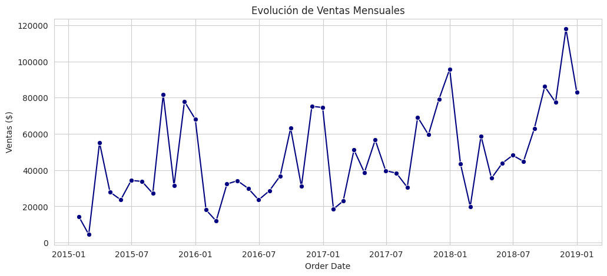
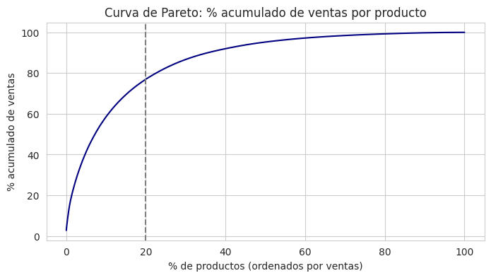

# Análisis de ventas de un retail: Superstore

Limpieza, análisis exploratorio y consultas SQL sobre 9.800 ventas de un retail de EE. UU. (2015-2018), con un dashboard en Looker Studio para presentar los resultados.

**Herramientas:** Python · pandas · NumPy · Matplotlib · Seaborn · SQL (SQLite) · Looker Studio · Jupyter / Google Colab



## Problema

Quería responder las preguntas que se haría el área comercial de un retail antes de planificar el año: cuánto se vende y con qué ticket, qué categorías y regiones sostienen el negocio, si las ventas crecen, en qué meses se concentran y qué tan dependiente es el negocio de pocos productos.

## Datos

- Fuente: [Superstore Sales Dataset](https://www.kaggle.com/datasets/rohitsahoo/sales-forecasting) (Kaggle, licencia GPL-2), archivo `data/superstore_sales.csv`.
- 9.800 líneas de venta, 4.922 órdenes y 18 columnas: fechas de orden y envío, cliente, segmento, ciudad, estado, región, categoría, producto y monto de venta (`Sales`, en USD).
- El dataset no incluye costos ni ganancia, así que el análisis es de ventas, no de rentabilidad.

## Método

1. **Calidad de datos:** una función que busca duplicados y nulos en las columnas críticas (orden, fecha, cliente, producto, venta). No hubo duplicados ni nulos críticos; los 11 códigos postales faltantes no afectan el análisis.
2. **Tipos:** convertí las fechas a `datetime` y los textos a `string[pyarrow]`.
3. **Outliers:** criterio de 1,5 × RIC sobre `Sales`, con boxplot. Los conservé porque son ventas reales de alto valor.
4. **KPIs y EDA:** ventas totales, órdenes, ticket promedio y evolución por mes, categoría y región.
5. **SQL:** cargué el DataFrame en SQLite en memoria y validé los KPIs con consultas `GROUP BY`: ventas por categoría, top 5 de productos y ticket promedio por región.
6. **Concentración y estacionalidad:** curva de Pareto por producto y participación de cada mes y año en las ventas.
7. **Exportación:** el dataset limpio se guarda en CSV para conectarlo al dashboard.

## Resultados

**KPIs generales:** USD 2.261.537 en ventas, 4.922 órdenes y un ticket promedio de USD 459,48.

**Las ventas crecen desde 2017:**

| Año | Ventas (USD) | Variación |
|---|---|---|
| 2015 | 479.856 | - |
| 2016 | 459.436 | -4,3 % |
| 2017 | 600.193 | +30,6 % |
| 2018 | 722.052 | +20,3 % |

**El último trimestre concentra las ventas.** Octubre a diciembre suman el 38,5 % de las ventas de los cuatro años. Noviembre (15,5 %), diciembre (14,2 %) y septiembre (13,3 %) son los meses más fuertes; febrero (2,6 %) y enero (4,2 %), los más débiles.

**Pocos productos explican la mayor parte de las ventas.** De 1.849 productos, el 20 % que más vende (370 productos) genera el 77 % de las ventas.



**Categorías y regiones:**

- Technology lidera con USD 827.456, seguida de Furniture (USD 728.659) y Office Supplies (USD 705.422).
- West es la región que más vende (USD 710.220), pero East tiene el ticket promedio más alto: USD 489,06 contra USD 447,52 de West. Central tiene el más bajo (USD 426,17).
- El producto más vendido es la copiadora Canon imageCLASS 2200 Advanced Copier: USD 61.600, más del doble que el segundo.

**Outliers:** 1.145 ventas (11,7 %) superan el límite de USD 500,64. La distribución tiene una cola larga: el negocio se sostiene con muchas ventas chicas y algunas muy grandes.

### Dashboard

[Ver el dashboard en Looker Studio](https://lookerstudio.google.com/reporting/a92aa016-395b-4c03-97ab-1d0f94a85d3b)


## Cómo ejecutarlo

Requisitos: Python 3.11 o superior.

```bash
git clone https://github.com/EmiiFernandez/analisis-ventas-superstore.git
cd analisis-ventas-superstore
pip install -r requirements.txt
jupyter notebook analisis_ventas.ipynb
```

El notebook se ejecuta desde la raíz del repo y guarda el dataset limpio en `output/superstore_limpio_final.csv`. En Google Colab, subir la carpeta `data/` junto con el notebook.

## Estructura del repo

```
analisis-ventas-superstore/
├── data/
│   └── superstore_sales.csv     # dataset original (9.800 filas)
├── images/                      # gráficos usados en este README
├── analisis_ventas.ipynb        # limpieza, EDA, SQL y exportación
├── requirements.txt             # dependencias con versiones probadas
└── LICENSE
```

## Próximos pasos

- Pasar las consultas SQL a una base PostgreSQL con un modelo de tablas (órdenes, clientes, productos) en lugar de una tabla única.
- Analizar clientes: frecuencia de compra, recurrencia y valor por segmento.
- Probar un modelo de pronóstico de ventas mensuales aprovechando la estacionalidad detectada.

---

Emilia Fernández · [LinkedIn](https://www.linkedin.com/in/emiliafernandez) · Código bajo licencia MIT
